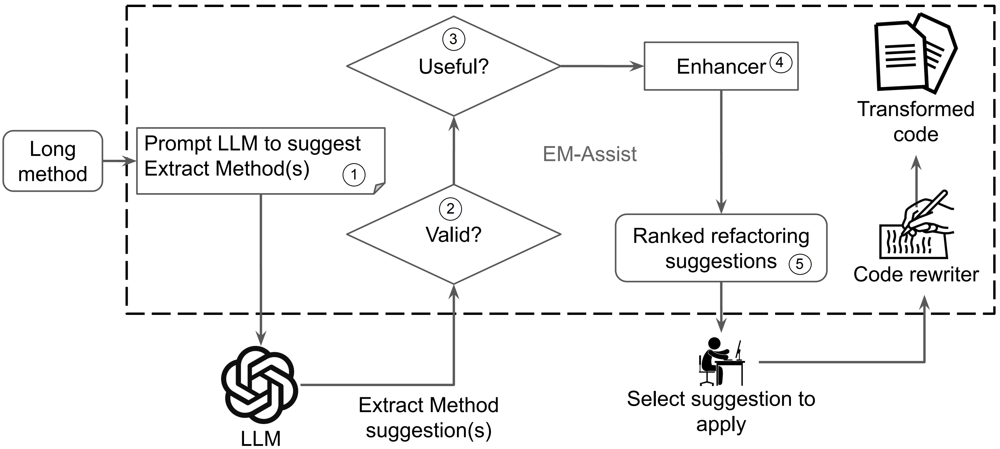

# EM-Assistant

Replication package for paper submission.
This repository contains an archive with IntelliJ IDEA plugin, installation and usage instructions.

### Table of Contents

- [Overview](#overview)
- [Requirements](#requirements)
- [OpenAI key configuration](#openai-key-configuration)
- [Plugin installation](#plugin-installation)
- [Usage example](#usage-example)
- [Prompt example](#prompt-example)
- [Datasets](#datasets)
- [Developer Survey](#developer-survey)

## Overview

An IntelliJ IDEA plugin that recommends Extract Function refactoring based on the LLM's suggestions.

The plugin is [available for free](https://plugins.jetbrains.com/plugin/23403-llm-powered-extract-method) on JetBrains Marketplace.



## Requirements

1. You need to install [IntelliJ IDEA](https://www.jetbrains.com/idea/download) 2023.1 or higher.
2. Configure OpenAI key.

## OpenAI key configuration

1. Sign up for OpenAI at https://beta.openai.com/signup.
2. Get your OpenAI API key.
3. Open IntelliJ IDEA, go to `Settings | Tools | Large Language Models` and enter your API key in the `OpenAI Key`field.

## Plugin installation

[Install the EM-Assist plugin](https://plugins.jetbrains.com/plugin/23403-llm-powered-extract-method) from JetBrains Marketplace.

## Usage example


To use the plugin, you need to right-click on the method, select `Show Context Actions` and click
on `Extract Function experiment`.
The plugin will then send a request to OpenAI and await a response. Once received, it will present the suggestions in a
dialog box,
the corresponding code for extraction will be highlighted.
To choose one of the suggestions, just right-click on it, and the plugin will automatically apply extract function
refactoring.

## Prompt example
Below you can find a sample prompt structure:

```java
OpenAiChatMessage(
   "system",
   """
           You are a skilled software developer. You have immense knowledge on software refactoring.
           You communicate with a remote server that sends you code of functions (one function in a message) that it wants to simplify by applying extract method refactoring.
           In return, you send a JSON object with suggestions of helpful extract method refactorings. It is important for suggestions to not contain the entire function body.
           Each suggestion consists of the start line, end line, and name for the extracted function.
           The JSON should have the following format: [{"function_name": <new function name>, "line_start": <line start>, "line_end": <line end>}, ..., ].
           """.trimIndent()
),
OpenAiChatMessage(
   "user",
   """
   280. public void connect(Figure figure) {
   281.     if (fObservedFigure != null)
   282.         fObservedFigure.removeFigureChangeListener(this);
   283.
   284.     fObservedFigure = figure;
   285.     fLocator = new OffsetLocator(figure.connectedTextLocator(this));
   286.     fObservedFigure.addFigureChangeListener(this);
   287.     if (fLocator != null) {
   288.         Point p = fLocator.locate(fObservedFigure);
   289.         p.x -= size().width/2 + fOriginX;
   290.         p.y -= size().height/2 + fOriginY;
   291.    
   292.         if (p.x != 0 || p.y != 0) {
   293.             willChange();
   294.             basicMoveBy(p.x, p.y);
   295.             changed();
   296.         }
   297.     }
   298. }
""".trimIndent()
),
OpenAiChatMessage(
   "assistant",
   """
           [
           {"function_name":  "updateLocator", "line_start":  288, "line_end": 296}
           ]
           """.trimIndent()
),
OpenAiChatMessage(
   "user",
   """
   92.  public void mouseUp(MouseEvent e, int x, int y) {
   93.      if (e.isPopupTrigger()) {
   94.          Figure figure = drawing().findFigure(e.getX(), e.getY());
   95.          if (figure != null) {
   96.              Object attribute = figure.getAttribute(Figure.POPUP_MENU);
   97.              if (attribute == null) {
   98.                  figure = drawing().findFigureInside(e.getX(), e.getY());
   99.              }
   100.             if (figure != null) {
   101.                 showPopupMenu(figure, e.getX(), e.getY(), e.getComponent());
   102.             }
   103.         }
   104.     }
   105.     else if (e.getClickCount() == 2) {
   106.         handleMouseDoubleClick(e, x, y);
   107.     }
   108.     else {
   109.         super.mouseUp(e, x, y);
   110.         handleMouseUp(e, x, y);
   111.         handleMouseClick(e, x, y);
   112.     }
   113. }
""".trimIndent()
),
OpenAiChatMessage(
   "assistant",
   """
           [
           {"function_name":  "computeFigure", "line_start":  94, "line_end": 103},
           {"function_name":  "computeAttribute", "line_start":  96, "line_end": 102}
           ]
           """.trimIndent()
),
OpenAiChatMessage(
   "user",
   codeSnippet
)
```

Here's an actual example of a prompt used:

```bash
2023-10-12 11:30:35,883 [2976602]   INFO - #c.i.m.l.t.models - Sending request to OpenAI API with model=gpt-3.5-turbo and

messages=[OpenAiChatMessage(role=system, content=You are a skilled software developer. You have immense knowledge on software refactoring.
You communicate with a remote server that sends you code of functions (one function in a message) that it wants to simplify by applying extract method refactoring.

In return, you send a JSON object with suggestions of helpful extract method refactorings. It is important for suggestions to not contain the entire function body.
Each suggestion consists of the start line, end line, and name for the extracted function.
The JSON should have the following format: [{"function_name": <new function name>, "line_start": <line start>, "line_end": <line end>}, ..., ].),

OpenAiChatMessage(role=user, content=
280. public void connect(Figure figure) {
281. 	if (fObservedFigure != null)
282.     	fObservedFigure.removeFigureChangeListener(this);
283.
284. 	fObservedFigure = figure;
285. 	fLocator = new OffsetLocator(figure.connectedTextLocator(this));
286. 	fObservedFigure.addFigureChangeListener(this);
287. 	if (fLocator != null) {
288.     	Point p = fLocator.locate(fObservedFigure);
289.     	p.x -= size().width/2 + fOriginX;
290.     	p.y -= size().height/2 + fOriginY;
291.
292.     	if (p.x != 0 || p.y != 0) {
293.         	willChange();
294.         	basicMoveBy(p.x, p.y);
295.         	changed();
296.     	}
297. 	}
298. }),

OpenAiChatMessage(role=assistant, content=[
{"function_name":  "updateLocator", "line_start":  288, "line_end": 296}
]), OpenAiChatMessage(role=user, content=

92.  public void mouseUp(MouseEvent e, int x, int y) {
93.  	if (e.isPopupTrigger()) {
94.      	Figure figure = drawing().findFigure(e.getX(), e.getY());
95.      	if (figure != null) {
96.          	Object attribute = figure.getAttribute(Figure.POPUP_MENU);
97.          	if (attribute == null) {
98.              	figure = drawing().findFigureInside(e.getX(), e.getY());
99.          	}
100.         	if (figure != null) {
101.             	showPopupMenu(figure, e.getX(), e.getY(), e.getComponent());
102.         	}
103.     	}
104. 	}
105. 	else if (e.getClickCount() == 2) {
106.     	handleMouseDoubleClick(e, x, y);
107. 	}
108. 	else {
109.     	super.mouseUp(e, x, y);
110.     	handleMouseUp(e, x, y);
111.     	handleMouseClick(e, x, y);
112. 	}
113. }), OpenAiChatMessage(role=assistant, content=[
{"function_name":  "computeFigure", "line_start":  94, "line_end": 103},
{"function_name":  "computeAttribute", "line_start":  96, "line_end": 102}
]), OpenAiChatMessage(role=user, content=

63. static void writeJvmClass(JvmClass jvmClass, DataOutput out) throws IOException {
64. 	writeJVMClassNode(jvmClass, out);
65. 	out.writeUTF(jvmClass.getSuperFqName());
66. 	out.writeUTF(jvmClass.getOuterFqName());
67. 	//  Write myInterfaces;
68. 	int interfacesCount = 0;
69. 	for (String myInterface : jvmClass.getInterfaces()) {
70.   	interfacesCount++;
71. 	}
72. 	DataInputOutputUtil.writeINT(out, interfacesCount);
73. 	for (String myInterface : jvmClass.getInterfaces()) {
74.   	out.writeUTF(myInterface);
75. 	}
76. 	//  Write myFields
77. 	int fieldsCount = 0;
78. 	for (JvmField field : jvmClass.getFields()) fieldsCount++;
79. 	DataInputOutputUtil.writeINT(out, fieldsCount);
80. 	for (JvmField field : jvmClass.getFields()) {
81.   	writeJvmField(field, out);
82. 	}
83.
84. 	//  Write myMethods
85. 	int methodCount = 0;
86. 	for (JvmMethod jvmMethod : jvmClass.getMethods()) methodCount++;
87. 	DataInputOutputUtil.writeINT(out, methodCount);
88. 	for (JvmMethod jvmMethod : jvmClass.getMethods()) {
89.   	writeJvmMethod(jvmMethod, out);
90. 	}
91.
92. 	//  Write AnnotationTargets
93. 	int elemTypeCount = 0;
94. 	for (ElemType elemType : jvmClass.getAnnotationTargets()) elemTypeCount++;
95. 	DataInputOutputUtil.writeINT(out, elemTypeCount);
96. 	for (ElemType elemType : jvmClass.getAnnotationTargets()) {
97.   	writeElemType(elemType, out);
98. 	}
99.
100. 	if (jvmClass.getRetentionPolicy() != null) {
101.   	out.writeUTF(jvmClass.getRetentionPolicy().name());
102. 	}
103. 	else {
104.   	out.writeUTF("");
105. 	}
106.   })]
2023-10-12 11:30:39,250 [2979969]   INFO - #c.i.m.llm - Raw response:
{
  "id": "chatcmpl-88ss0b30S6ZiMDQ24ImloFrYjVrEy",
  "object": "chat.completion",
  "created": 1697128236,
  "model": "gpt-3.5-turbo-0613",
  "choices": [
	{
  	"index": 0,
  	"message": {
    	"role": "assistant",
    	"content": "[\n
{\"function_name\":  \"writeInterfaces\", \"line_start\":  69, \"line_end\": 75},\n
{\"function_name\":  \"writeFields\", \"line_start\":  78, \"line_end\": 82},\n
{\"function_name\":  \"writeMethods\", \"line_start\":  86, \"line_end\": 90},\n
{\"function_name\":  \"writeAnnotationTargets\", \"line_start\":  94, \"line_end\": 98}\n]"
  	},
  	"finish_reason": "stop"
	}
  ],
  "usage": {
	"prompt_tokens": 1116,
	"completion_tokens": 99,
	"total_tokens": 1215
  }
}
```

# Datasets

Datasets are accessible via the provided [link](https://github.com/llm-refactoring/llm-refactoring-plugin/tree/main/datasets).

To validate our technique, we used the following datasets:

1. _Community Corpus_ consists of **122** Java methods and their corresponding Extract Method refactorings collected
   from
   five open-source repositories: MyWebMart, SelfPlanner, WikiDev, JHotDraw, and JUnit.
   This dataset previously served as the foundation for evaluating various state-of-the-art Extract Method refactoring
   automation tools, including JExtract, JDeodorant, SEMI, GEMS, and REMS.

2. _Extended Corpus_: To enhance the robustness of our evaluation with a sizable oracle of
actual refactorings performed
by
developers, we constructed Extended Corpus. To create it, we employed RefactoringMiner for
detecting _Extract
Method_.
We ran it on 12 highly regarded open-source repositories: CoreNLP, infinispan, HtmlUnit, robovm, google/guava, mbassador, spring-boot, google/gson, smart-doc, bytes-java, apache/datasketches-java, javaparser. After filtering to
remove
refactoring commits that mixed feature additions (the one-liners and the extracted methods
whose body overlapped a
large
proportion of the host method), we retain **1752** _Extract Methods_ from these
repositories.

## Dataset Details

The datasets included in this repository are represented in JSON format. We have used MongoDB to perform queries and
navigate through the data.

### Raw Data

#### Oracle

Each record has an attribute named _"oracle"_. For example:

```json
{
  ...
  "oracle": {
    "line_start": 612,
    "line_end": 630,
    "url": "https://github.com/JetBrains/intellij-community/tree/405abc6878abe05f755a5a0a349a880139b9163e/plugins/maven/src/test/java/org/jetbrains/idea/maven/dom/MavenFilteredPropertiesCompletionAndResolutionTest.java#L612-L630"
  },
  ...
}
```

The _"oracle"_ represents the _Extract Method_ refactoring that was performed by the developer. This oracle is used
throughout the evaluation process.

#### LLM raw data

Our study involved querying multiple LLMs with various temperatures. This LLM response data was saved and further used for
answering RQ1, RQ2, and RQ3. This data can be found in the attribute _"response_extracted"_.
For example:

```json
{
  ...
  "llm_multishot_data": {
    "temperature_<temperature_value>": [
      {
        "response_extracted": "[{\"function_name\":  \"extractedMethodName\", \"line_start\":  442, \"line_end\": 443}\n]", 
        "shot_no": 0
      }
    ],
     ...
  }
}
...
]
}
}
```

#### Ranked candidates

Suggestions coming from LLMs are transformed into candidates by our tool. The data used to answer **RQ3: How effective
is
EM-Assist in providing refactoring recommendations over existing approaches?**
we used the data stored in the _"jetgpt_ranking"_ property as shown in the following example:

```json
{
  ...
  "jetgpt_ranking": {
    "llm_multishot_data": {
       "<HEURISTICS_KEY>": {
         "temperature_<temperature_value>": {
           "rank_by_popularity_times_heat": [
             {
               "candidate_type": "AS_IS",
               "application_result": "OK",
               "line_start": 612,
               "line_end": 630,
               ...
             }
           ],
           ...
         }
       }
    }
  },
  ...
}
```

#### Suggestion evaluation

The data used to answer **RQ1: How effective are LLMs at generating refactoring suggestions?**, can be found in the
_"suggestion_evaluation"_ JSON attribute:

```json
{
  ...
  "suggestion_evaluation": {
    "llm_multishot_data": {
      "temperature_<temperature_value>": [
        {
          "candidate_type": "AS_IS",
          "application_result": "OK",
          "application_reason": "",
          ...
        }
      ]
    }
  },
  ...
}
```

#### J-Extract execution data

To further strengthen the validity of our results, we applied EM-Assist on the _Extended Corpus_ that includes 1752
actual
refactorings from open-source projects. We applied the previous best in class static analysis tool J-Extract, to the same dataset. The raw data for
J-Extract results is stored in the _"jextract_analysis"_ JSON attribute:

```json
{
  ...
  "jextract_analysis": {
    "candidates": [
      {
        "line_start": 274,
        "line_end": 276,
        "length": 3
      }
    ]
  },
  ...
}
```

### Processed data

The raw data described above was further processed to obtain various statistical analysis data.

#### RQ1 processed data

LLM effectiveness: `datasets/evaluation/extended_corpus/tool_evaluation__extended_corpus_llm_effectiveness_RQ1.csv`

#### RQ3 processed data

Our tool: `datasets/evaluation/extended_corpus/tool_evaluation__extended_corpus_ranking_RQ3.csv`

LiveRef: `datasets/evaluation/extended_corpus/tool_evaluation__extended_corpus_ranking_RQ3.csv`

# Developer Survey

Our tool is a code renovation tool that developers use interactively, it is important to evaluate whether our tool makes
suggestions that developers accept. We employ firehouse surveys with professional developers from our collaborating
enterprises, focusing on newly created long methods they committed into code repositories. Then, we report their
responses regarding the refactoring recommendations proposed by our tool.

The table below summarizes the results meant to answer **RQ4. How useful are the provided recommendations to developers?**

| User |                                                                                                                                       Method                                                                                                                                       |                                                   Screenshot                                                    | Strongly<br/>Agree | Agree | Somewhat<br/>Agree | Somewhat<br/>Disagree | Disagree | Strongly<br/>Disagree |
|:-----|:----------------------------------------------------------------------------------------------------------------------------------------------------------------------------------------------------------------------------------------------------------------------------------:|:---------------------------------------------------------------------------------------------------------------:|:------------------:|:-----:|:------------------:|:---------------------:|:--------:|:---------------------:|
| P1   |                             [doGetSeverity()](https://github.com/JetBrains/intellij-community/blob/2c9c987ef6749e8b9ccab3f1562fba3aff605cde/platform/analysis-impl/src/com/intellij/codeInspection/DefaultInspectionToolResultExporter.java#L311-L332)                             |                   [screenshot_p1](datasets/survey_screenshots/64f906ca0164c6586f8819c8_1.png)                   |                    |   X   |                    |                       |          |                       |
| P2   | [buildExternalProjectHierarchy()](https://github.com/JetBrains/intellij-community/blob/b447fdab8cd0c87e6d48ffc11b062992fff99f07/plugins/gradle/tooling-extension-impl/src/com/intellij/gradle/toolingExtension/impl/modelProvider/GradleExternalProjectModelProvider.java#L53-L78) |                   [screenshot_p2](datasets/survey_screenshots/64f21f6627a544013cde9c57_1.png)                   |                    |       |                    |                       |          |           X           |
| P3   |                    [fillQualifierAsArgumentContributor()](https://github.com/JetBrains/intellij-community/blob/e606e6f1e3c129757447719d198432ea78349091/java/java-impl/src/com/intellij/codeInsight/completion/JavaQualifierAsArgumentContributor.java#L50-L76)                    |                   [screenshot_p3](datasets/survey_screenshots/64f9e7d9a7fab75702a0f751_1.png)                   |                    |   X   |                    |                       |          |                       |
| P4   |                        [createDependencyDataNode()](https://github.com/JetBrains/intellij-community/blob/a37fd0a06377d42b59adff93878d1d95bba03659/plugins/gradle/src/org/jetbrains/plugins/gradle/service/project/GradleProjectResolverUtil.java#L744-L776)                        |                   [screenshot_p4](datasets/survey_screenshots/64f9e7d9a7fab75702a0f76a_1.png)                   |                    |   X   |                    |                       |          |                       |
| P5   |                                      [findMethodToRun()](https://github.com/JetBrains/intellij-community/blob/9a04255f75b17e689b5fe5928f03d6365e632dff/java/java-runtime/src/com/intellij/rt/execution/application/AppMainV2.java#L160-L191)                                       |                   [screenshot_p5](datasets/survey_screenshots/64ff9b2f246a4c7ce85e5d59_1.png)                   |                    |       |         X          |                       |          |                       |
| P6   |                   [loadPluginModules()](https://github.com/JetBrains/intellij-community/blob/fe6567a53b41c882ccdff76a4f308d694889b78a/platform/runtime/repository/src/com/intellij/platform/runtime/repository/serialization/impl/PluginXmlReader.java#L19-L67)                    |                   [screenshot_p6](datasets/survey_screenshots/64ff9b2f246a4c7ce85e5d57_1.png)                   |                    |       |                    |                       |    X     |                       |
| P7   |                                [showInlayRunToCursor()](https://github.com/JetBrains/intellij-community/blob/48cec9a6137c245b2a18e33e06f5018b83bd92d3/platform/xdebugger-impl/src/com/intellij/xdebugger/impl/XDebuggerManagerImpl.java#L533-L615)                                 |                   [screenshot_p7](datasets/survey_screenshots/64ff9b2f246a4c7ce85e5d6d_1.png)                   |                    |       |         X          |                       |          |                       |
| P8   |                             [doGetIllegalDependencies()](https://github.com/JetBrains/intellij-community/blob/3220db7ada68d2dc878eaeac79119df1d13b43c7/platform/analysis-impl/src/com/intellij/packageDependencies/DependenciesBuilder.java#L94-L119)                              |                   [screenshot_p8](datasets/survey_screenshots/64ff9b2f246a4c7ce85e5d70_1.png)                   |                    |       |                    |                       |          |           X           |
| P9   |                                [stripTextBlockIndent()](https://github.com/JetBrains/intellij-community/blob/358ad307c273983bef197efed57d4812b51c8b0a/java/java-psi-impl/src/com/intellij/psi/impl/source/tree/java/PsiFragmentImpl.java#L96-L128)                                 |                   [screenshot_p9](datasets/survey_screenshots/64ff9b2f246a4c7ce85e5d78_2.png)                   |                    |   X   |                    |                       |          |                       |
| P10  |                                           [checkLibraries()](https://github.com/JetBrains/JetBrainsRuntime/blob/7e8a41055c93578d5d7afb6d1fe44177bd927c06/src/java.desktop/share/classes/sun/font/FontManagerNativeLibrary.java#L84-L134)                                           |             [screenshot_p10](datasets/survey_screenshots/65021a87c5acc040810d667d_1_selection.png)              |                    |   X   |                    |                       |          |                       |
| P11  |                                           [step()](https://github.com/JetBrains/JetBrainsRuntime/blob/01c2d0f6c90e9a41c4daaecb85c577f97be47d59/src/java.base/share/classes/com/jetbrains/internal/ProxyDependencyManager.java#L86-L115)                                            |             [screenshot_p11](datasets/survey_screenshots/65021a87c5acc040810d66bb_3_selection.png)              |         X          |       |                    |                       |          |                       |
| P12  |                                                  [checkXInput()](https://github.com/JetBrains/JetBrainsRuntime/blob/037536c5ebd758dd63331683fc9c07e72548e460/src/java.desktop/unix/classes/sun/awt/X11/XToolkit.java#L2432-L2464)                                                  |             [screenshot_p12](datasets/survey_screenshots/65021a87c5acc040810d66e3_2_selection.png)              |         X          |       |                    |                       |          |                       |
| P13  |                                          [collectAnnotations()](https://github.com/JetBrains/intellij-community/blob/e19b3396e9e5eddd10009ee4758fd37afe7b397e/java/java-psi-impl/src/com/intellij/psi/impl/cache/TypeInfo.java#L418-L460)                                          | [screenshot_p13](datasets/survey_screenshots/intellij-community-collectAnnotations-extraction-suggestion-2.png) |                    |       |         X          |                       |          |                       |
| P14  |                                  [writeJvmClass()](https://github.com/JetBrains/intellij-community/blob/a84474dd9e8a5b1b1a4fabe2b2211bf28430026d/jps/jps-builders/src/org/jetbrains/jps/dependency/impl/serializer/SerializerUtil.java#L63-L106)                                   |    [screenshot_p14](datasets/survey_screenshots/intellij-community-readJvmClass-extraction-suggestion-1.png)    |                    |       |         X          |                       |          |                       |
| P15  |                               [detectLombokJarsSlow()](https://github.com/JetBrains/intellij-community/blob/2bfb37c6886c5a8e4ac5edb2038b647f05f74d6f/plugins/lombok/src/main/java/de/plushnikov/intellij/plugin/util/LombokLibraryUtil.java#L42-L75)                               |         [screenshot_p15](datasets/survey_screenshots/detectLombokJarsSlow-extraction-suggestion-1.png)          |                    |       |         X          |                       |          |                       |
| P16  |                                            [getProcessOutput()](https://github.com/JetBrains/intellij-community/blob/02e863680e945c4d514cc6aa7142507e00c7b190/python/python-sdk/src/com/jetbrains/python/sdk/PySdkUtil.java#L119-L171)                                             |           [screenshot_p16](datasets/survey_screenshots/getProcessOutput-extraction-suggestion-3.png)            |                    |   X   |                    |                       |          |                       |
